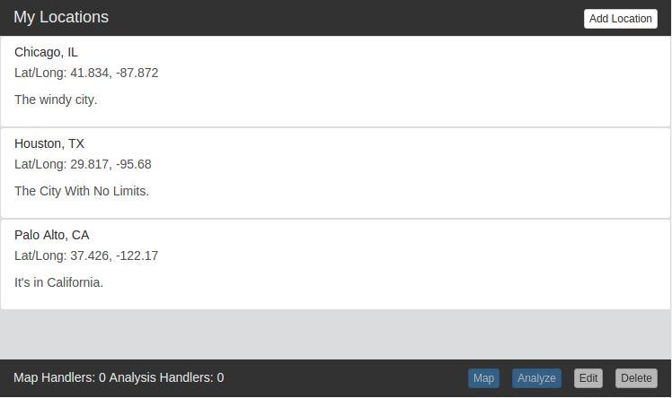
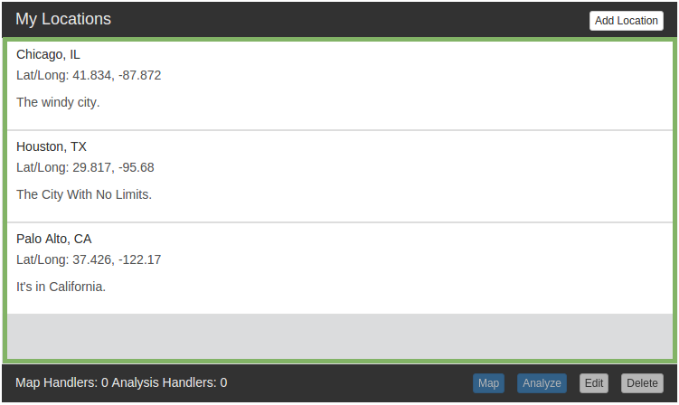
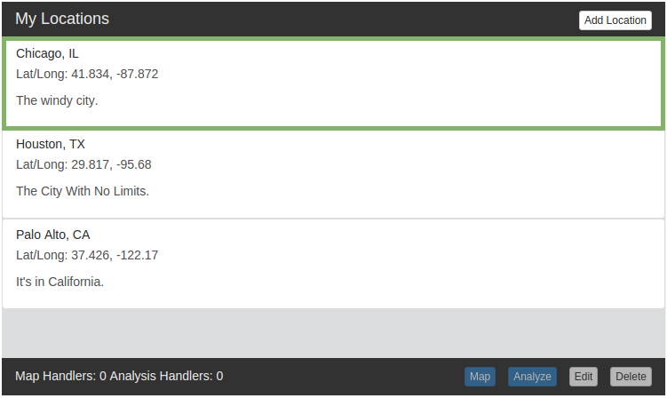
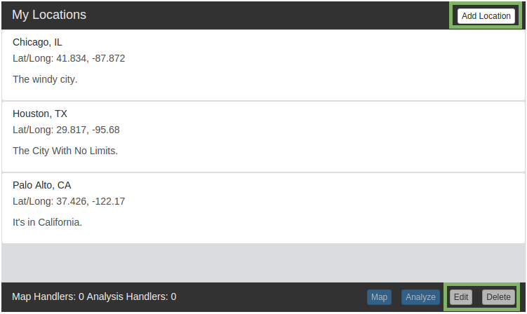
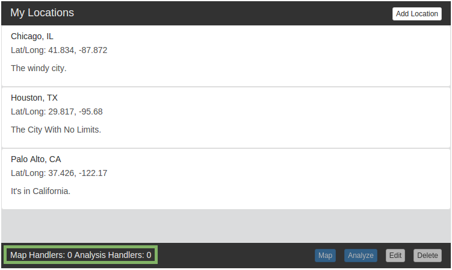
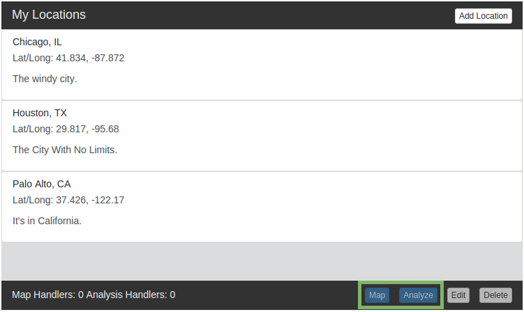

To understand this tutorial, understanding how to create & connect an IWC client
is necessary, as well as an understanding of the Data & Intents API. Advanced
references are used in this application to aid in references that collect.

**This tutorial does not cover the framework used to create the application
(AngularJS) nor the styling applied (Bootstrap). The purpose is to show the
connectivity of IWC to the applications components. The code has been
generalized, the actual angular application can be found [here](https://github.com/ozone-development/ozp-demo/tree/master/app/locationLister)**

***

# Location Lister


The Location Lister is one of the example apps hosted on the [homepage]({{site.baseurl}}/)
of the IWC website. It is an application that allows users to store GPS
coordinates along with any useful description data they may choose. If this
application was ran on a private IWC bus (not the github hosted IWC), it could
persist the users entries beyond their current session.

This application performs the following tasks:

* Create a location entry (GPS coordinate, description, and name)
* Edit a location entry
* Delete a location entry
* Dynamically list all location entries

With a mapping application open as well, this application performs the following
tasks:

* Plot a location on the selected map.

With an analyzing application open as well, this application performs the following
tasks:

* Send a location to be analyzed.

***

# Dynamically List Locations

_Data gathered by the /locationLister/listings reference (collection enabled)_

The Location Lister application stores its locations by storing a pairing of
a **reference** and a **value** locally.

To initialize the applications set of locations, a **reference** is generated
to the parent resource of all the location data, `/locationLister/listings`,
with the advanced option `collect` set to `true` to allow this reference to
receive updates about created/destroyed locations (when registering a watch).

```js

//=======================================
// Location List: a collection of Locations
//
// IWC References (Uses in this application):
// API: Data
// Resource: /locationLister/listings/*
// Collects: none
//=======================================
function LocationList(resource) {
  this.reference = new iwc.data.Reference(resource, {
    collect: true
  });
  this.addLocation = this.reference.addChild;
  this.locations = {};
  var self = this;

  var handleCollection = function(collection) {
    collection.forEach(function(resource) {
      if (!self.locations[resource]) {
        self.locations[resource] = new Location(resource);
      }
    });
  };

  var onCollectionChange = function(changes) {
    handleCollection(changes.newCollection);
  };

  // Watch For new locations added to the collection
  this.reference.watch(onCollectionChange);
  // Get the initial collection
  this.reference.list().then(handleCollection);
}

var locationList = new LocationList('/locationLister/listings');
```

**Disecting the above code:**

* The **reference** generated to watch and gather the list of locations is
    stored as a property of the `LocationList` object,`locationList`.

* `locationList.reference` adds the watch callback `onCollectionChange` to handle changes
    to the collection.

* `locationList.reference` gets the initial collection with the list action.

* When the collection of locations (resources pathed below `/locationLister/listings/`
    in the Data API) changes, if there is a new location, a `Location`
    is created and added to `locationList.locations`.

* `LocationList` ties its reference's `addChild` method to `addLocation` for
    simple additions to its collection.


***
# List Location Structure


```js
//=======================================
// Location
//
// IWC References (Uses in this application):
// API: Data
// Resource: /locationLister/listings/<AutoGenerated ID>
// Collects: none
//=======================================
function Location(resource) {
  this.reference = new iwc.data.Reference(resource);
  this.resource = resource;
  this.update = this.reference.set;
  this.delete = this.reference.delete;
  this.value = {};
  var self = this;

  var onChange = function(changes) {
    self.value = changes.newValue;
  };

  this.reference.watch(onChange).then(function(val) {
    self.value = val;
  });
}

```

**Disecting the above code:**
* Each `Location` contains a reference to its location's resource.

* Each `Location` when constructed, registers a watch callback to update
    its `value` property whenever the resource changes.

* Each `Location` gets an initial state of its resource when constructed,
    because the watch promise resolves with the current state of the resource.

* Each `Location` will clear itself should its resource be deleted.
    This is because the `changes.newValue` that is passed to the `onChange`
    callback will equal undefined when the resource is deleted. Additionally
    `changes.deleted` will be set to true, but not utilized in this demonstration.

* Each `Location` ties simple function names to its reference:
    * `update` calls `reference.set`    
    * `delete` calls `reference.delete`

***

# Create, Edit, and Delete Locations


## Add Location
```js
// Called when the "Add Location" button is pressed
// Opens popup modal, resolves with the input data.
// Autogenerates the resouce in the locationList collection.
var addListing = function(location) {
  return locationModal(location).then(function(output) {

    return locationList.addLocation(output.listing).catch(function(e) {
      console.log(e);
    });
  });
};
```

**When the `Add Listing` button is pressed:**
* A UI modal is opened (not part of IWC) that resolves with the data that
    will be stored in the new IWC Data Api resource.

* The `locationList` from the above section uses the `addChild` method to
    store this new data within the `listingsRef` collection (the exact resource
    path is autogenerated). This triggers the **watch callback** in the
    **Dynamically List Locations** section to update the list (on all open
    Location Lister applications) with a new `Location`.

## Edit Location
```js
// Called when "Edit" is clicked.
var editLocation = function(location) {
  if (location) {
    locationModal(location.value).then(function(output) {
      // Use the location's reference to update the resource
      location.update(output.listing);
    });
  }
};
```

**When a location is selected and the `Edit` button is pressed:**
* The `Loction` that is currently selected is passed to the `editLocation` function.

* The value is passed to the popup modal for editing. When resolved, the
    location's `update` method is called. (Alias to reference.set)

* The `Location` receives the updated data in its `value` because of its watch
    callback.

## Delete Location
```js
location.delete();
```
When a location is selected and the `Delete` button is pressed, the locations
`delete` method is called. (Alias to reference.delete)

***

#Intent Use
The Location Lister uses 3 intent resources:

* **Outgoing**
    * `/json/coord/map`: Sends the path of a `Location` resource for another
        application to map.
    * `/json/coord/analyze`: Sends the **coordinates** of a `Location` for
        another application to analyze.
* **Incoming**
    * `/json/coord/save`: Registers to receive formated coordinate data
        and creates `Locations` to add to the list.

To simplify UI tie-ins, the Location Lister application wraps the creation of
**Intents API references** into a class called **Intent**.

```js
//=======================================
// Intent: A wrapper for invoking remote functions
//         as well as tracking the number of
//         matching functions.
//
//=======================================
function Intent(resource) {
  // collection enabled to tie # of handlers to the UI
  this.reference = new iwc.intents.Reference(resource, {
    collect: true
  });
  this.run = this.reference.invoke;
  this.register = this.reference.register;
  this.handlers = [];

  var self = this;

  var handleCollection = function(collection) {
    self.handlers = collection;
    $scope.$apply();
  };

  var onCollectionChange = function(changes) {
    handleCollection(changes.newCollection);
  };

  // Watch for updates the the collection
  this.reference.watch(onCollectionChange);
  // Get initial collection
  this.reference.list().then(handleCollection);
}
```

An instance of **Intent** contains:

* A **reference** to the specified Intents API resource.

* Encapsulated logic for tracking the number of available handlers for the
    intent in its `handlers` property. This is done by using the watch/list
    functionality as used on the `LocationLister` above.

* Simplified method names:
    * `run` ties to `reference.invoke` for calling the remote functionality
    * `register` ties to `reference.register` for registering a function for
        remote use.
***

# Outgoing Intents
## Counter

As explained above, the local class `Intent` keeps track of its handlers,
so visually displaying the number of applications open to map/analyze is
done by accesing the `Intent` instance's `handlers.length`.

## Invoking


With the local class `Intent` having a `run` method tied to `reference.invoke`,
invoking a **map** intent is done with:
```js
var map = new Intent("/json/coord/map");
map.invoke("/locationLister/Listing/123")
```

The `/json/coord/map` intent is specified to receive a **data api resource path**
in order to allow the map to watch for changes and update the position.
If a location is mapped to the Location Mapper, then edited, the change will be
reflected on the map.

The `/json/coord/analze` intent is relies only on the coordinate data of the
location, so it does not accept the **data api resource path**  rather an object
containing the location coordinates:
```js
{
    lat: 1,
    long: 12
}
```

**While the Location Lister does not expect any results on its intent invocations**,
an intent invocation will resolve with a result if the registered handling function
**returns a value**.
***

# Inbound Intents
The Location Lister registers to handle saving location data.

```js
//=======================================
// Save Intent (Register for Remotes)
//=======================================
var save = new Intent("/json/coord/save");

var metaData = {
  icon: "http://some.website.io/iconPath.png",
  label: "Location Lister"
};

// The functionality to share. Opens the modal for saving the received location.
var saveLocation = function(location) {
  if (location && location.title && location.coords) {

    // Returns the new Location resource path to the invoker when finished
    return addListing(location);
  }
};
save.register(metaData, saveLocation);
```

The registration takes 2 parts:

1. **Meta Data**: the intent is registered with an icon and label. In the event
that multiple handlers are registered for `/json/coord/save` the user will be
prompted with a popup and this meta data distinguishes each handler.
2. **Handler**: the function that is ran to handle the saving.

In this application a modal is opened with the received data for the user
to save, and upon saving the invoker of the intent (the application that
calls **invoke**) the output.

The output of the `saveLocation` handler is the Data Api path to the
new `Location` that was made. This is used by the Location Analyzer
to gather information about the new `Location` it helped create.
