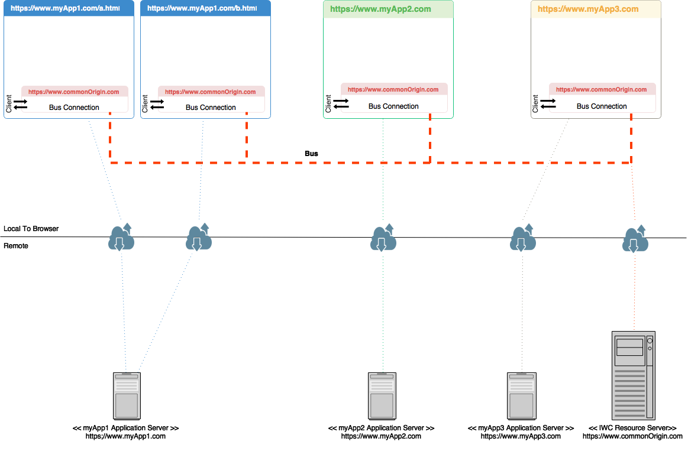

##Overview
The IWC is composed of two components, a **client** and a **bus**.

####Client
The client component of the IWC is standard amongst all IWC instances. It is a library that applications use to connect 
to and make requests on any given bus. To connect to a bus, the client library opens the desired
bus in an invisible iFrame. In order to talk across the domain of the application and the domain of the bus, the client and
bus components have a defined protocol for making cross origin requests. 

The client component resides in the domain of the application, while the bus component resides in the domain hosting 
the bus. In some deployment instances this may be the same domain.

**Application developers should follow the [Client Documentation]() to get their applications configured to use the
IWC client and learn about the various IWC api functionality.**

####Bus
The bus component of the IWC acts as a **local** network for clients to communicate through. 

While each client's connection to the network opens an instance of the bus component in an iFrame, 
distributed consensus algorithms are used to determine that only one instance of the bus component is running. When said 
bus component becomes unavailable, the consensus algorithms are used to redirect IWC traffic to a different bus 
component.

**Platform hosts should follow the [Bus Documentation]() to understand how to interface the IWC bus with their 
backend, configure deployments, and enforce policies.**

A running bus component communicates with its remote server to gather information regarding available applications, 
preferences, persisted data and permission level to enhance functionality of clients (applications) connected. More 
information on communication with the remote server can be found in the [Server communications](serverComms.md) section.

A client (application) can only communicate with other clients(applications) connected to the same bus, this is due to the 
security measures put in place for [cross-origin resource sharing(CORS)] (http://www.w3.org/TR/cors/). Bridging two
buses together (joining two bridge domains) is possible, but not implemented at this time.
